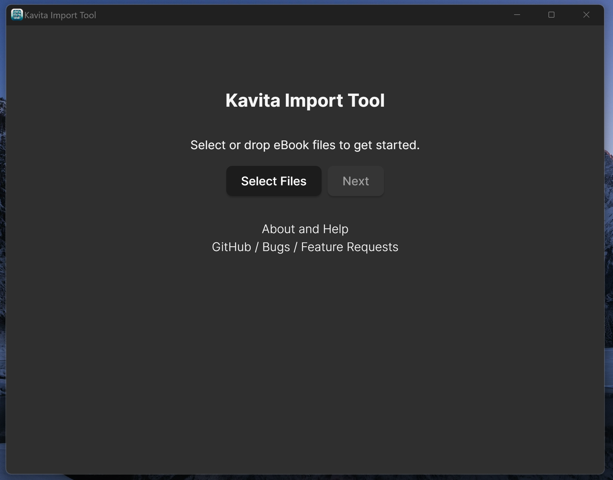
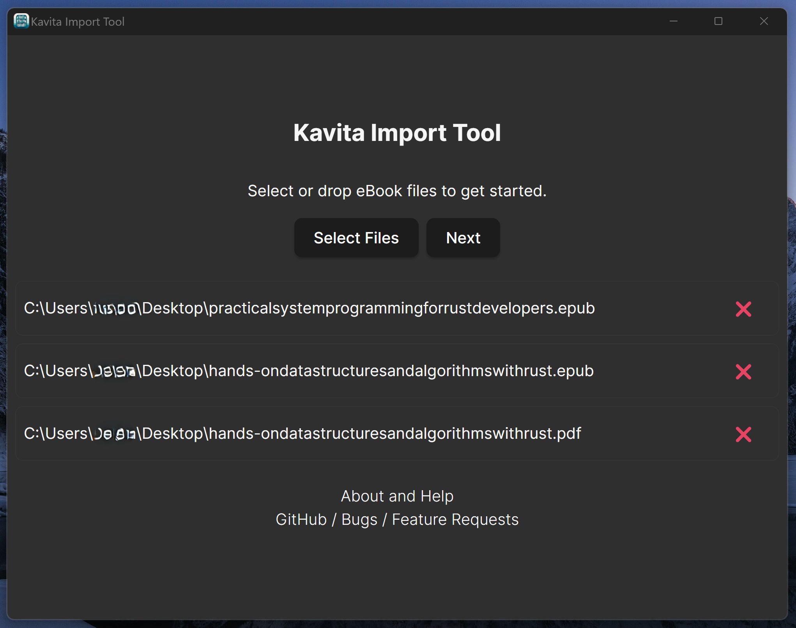
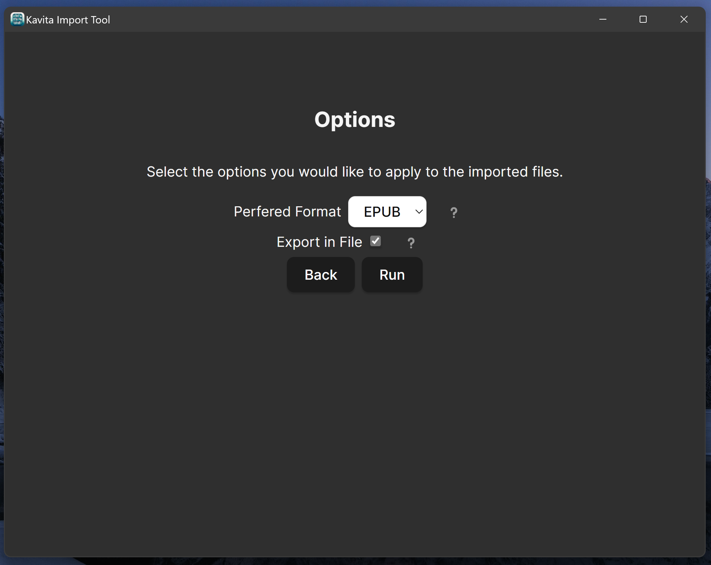
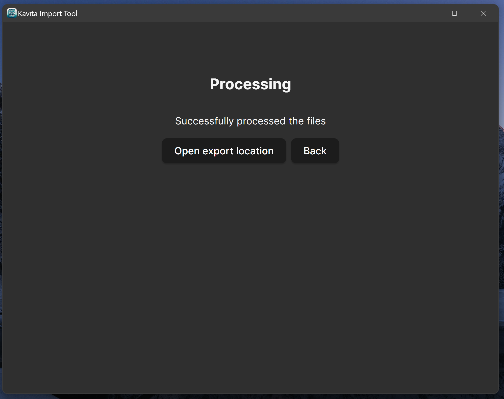

# Quickstart

1. Download the latest release for your operating system from the [releases page](https://github.com/mackenly/kavita-import-tool/releases).
2. Install the program on your machine. Some targets have installers, others require a manual approach.
3. The code might not be signed for your operating system. So you may need to allow the program to run in your security settings. I hope to fix this evenutaly, but the costs are prohibitive at the moment ([Interested in sponsoring?](https://github.com/sponsors/mackenly)).
4. Run the program and follow the prompts to create the file structure for your books. The following detailed instructions walk you through the process.

## Processing Files
### Step 1: Select the files you want to process

Begin by opening the program and adding the files you want to process. You can press "Select Files" or simply drag and drop the files into the program.

### Step 2: Confirm the files you want to process

After selecitng or dropping your files, you should see them in the file list. If you need to remove any files, you can do so by selecting the file and pressing the "❌" button. Once you are satisfied with the files you have selected, press the "Next" button to continue.

### Step 3: Select options

Make selections for the following or leave them as default:
- Perfered Format: This selector allows you to pick a perffered format. When you import files with the same name, but different formats, this options chooses which one to actually use. By default the order is `epub`, `pdf`, `cbz`, `zip`, `rar`, `cbr`, `tar.gz`, `7zip`, `7z`, `cb7`, `cbt`, `png`, `jpeg`, `jpg`, `webp`, `gif`, and `avif`, however, it will fall back to any file if not one of those.
- Export in File: This option allows you to choose if you want to export the files directly into the output folder or into a container folder. The container folder is useful if you want to not clutter your output folder.
After making your selections, press the "Run" button to continue.

### Step 4: Select the output folder

After pressing the "Run" button, you will be prompted to select the output folder. This is where the files will be exported to.

### Step 5: Your done!
If you selected export in a file you will now have a folder named `kavita-import-tool-output-[epoch time]` in your output folder, otherwise you will have all the folders in your output folder.

You can choose to open the export locaiton or find it yourself.

It's important to note that the original files are not modified in any way. The program only creates a file structure and copies the files to the output folder.

